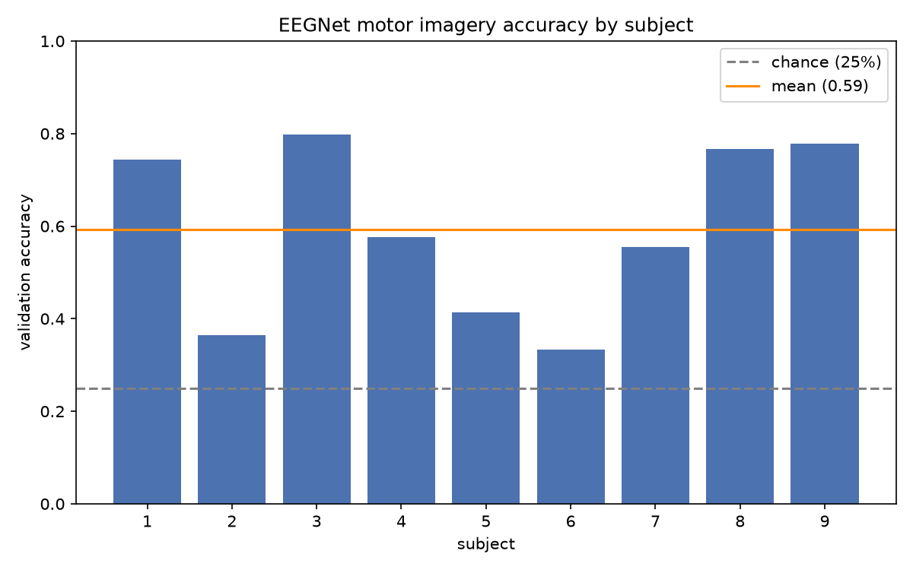
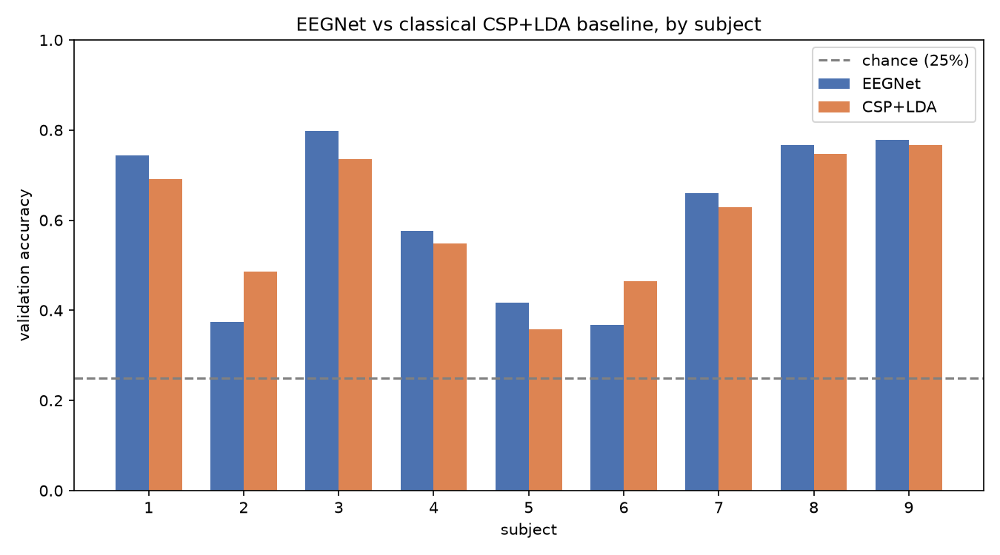
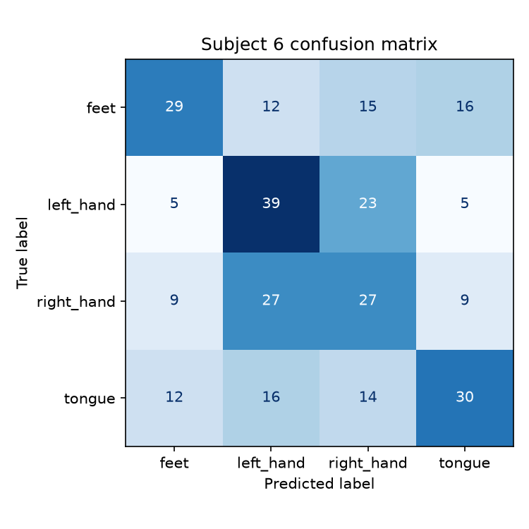
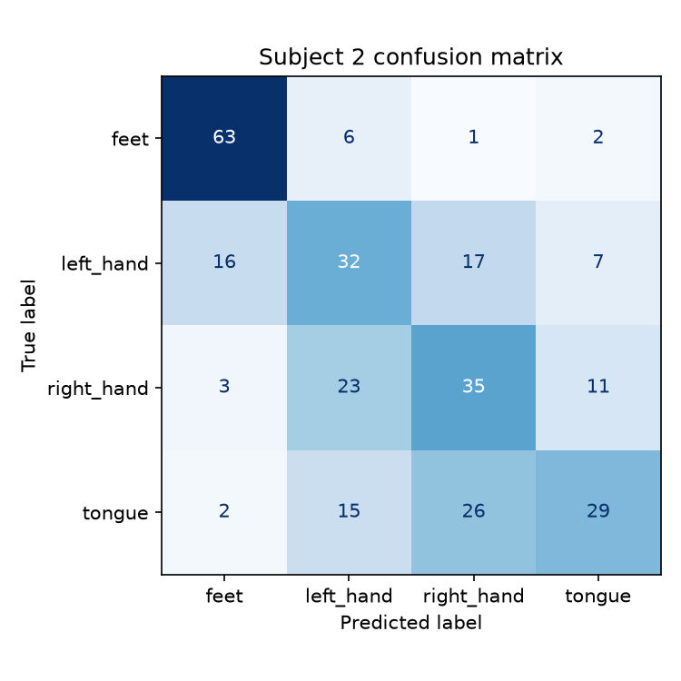
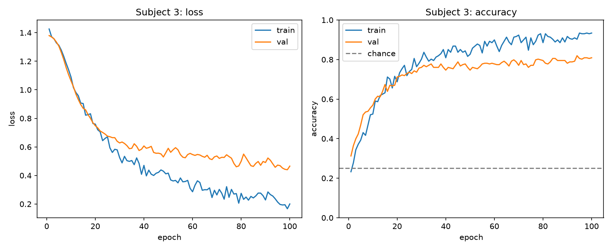

# Motor Imagery EEG Classification with Deep Learning

Classifying imagined limb movement (left hand, right hand, feet, tongue) from raw EEG using an
EEGNet-style CNN in PyTorch, compared against a classical CSP+LDA baseline.

Dataset: BCI Competition IV Dataset 2a (9 subjects, 22 EEG channels, 4-class motor imagery),
loaded via [MOABB](https://neurotechx.github.io/moabb/) (MOABB names it `BNCI2014_001`).

## Key results

- Across 5 tested seeds per subject (0-4), EEGNet beats the CSP+LDA baseline on a majority of
  seeds (at least 3 of 5) for 7 of 9 subjects, losing on a majority of seeds for only 2 of 9
  (subjects 2 and 6). Using each subject's median-of-5-seeds accuracy, EEGNet's mean is ~61.6% vs.
  the baseline's 60.3% - a modest +1.3 percentage point difference in validation accuracy under
  the current checkpoint-selection procedure, not a demonstrated generalization edge (see "How
  stable are these results?" below for the full per-subject table, and the Methodology caveat on
  what these numbers do and don't measure).
- The single documented reproduction command (`run_all_subjects.py`, seed 42 for every subject)
  produces a larger-looking margin: 64.2% mean, winning 6 of 9 subjects and losing 6, 8, and 9.
  That number is what the commands below are set up to reproduce (see the note in "Reproducing
  the results" on why the exact figures aren't guaranteed to match), but seed 42 is a documented
  outlier relative to the 5 separately tested seeds (0-4) for several subjects - for subject 2 it
  lands near the top of that tested range (higher than 4 of the 5, though not the single highest:
  one tested seed reached 56.2% vs. seed 42's 55.2%), and for subjects 8 and 9 it lands below the
  entire tested range - so it isn't the number I'm leading with.
- CSP+LDA baseline: 60.3% mean validation accuracy, untuned (see "Did tuning the baseline help?"
  below).
- Best result in the documented seed-42 run: 81.9% (EEGNet, subject 3) - though this
  understates that subject's typical performance (5-seed median 86.5%) and isn't even the
  highest value observed for subject 3 across all tested seeds: one of the 5 additional seeds
  reached 87.8%.
- Cross-validating the baseline's own hyperparameters (CSP components, LDA shrinkage) didn't
  improve it - mean accuracy actually dropped slightly to 59.7% (see "Did tuning the baseline
  help?" below)
- 4-class motor imagery, 22 EEG channels, 576 trials/subject total
- A shape-inference bug (a dummy forward pass used to compute the model's flattened feature
  size was running in training mode) was quietly hurting EEGNet's accuracy on several subjects
  until fixed - most dramatically subject 2, up 17.7 percentage points once fixed. The fix bundles
  two effects together (it stops BatchNorm's running stats from being corrupted, but also shifts
  the classifier's initial weights via a random-number-stream change - see Methodology), so I
  can't cleanly attribute the improvement to BatchNorm alone. See the note in Methodology and the
  "Confusion matrices" section below.

## Methodology

- **Preprocessing**: raw EEG band-pass filtered to 4-38Hz (covers the mu/beta rhythms relevant
  to motor imagery), epoched to 0-4s relative to cue onset, all 22 channels used.
- **Split**: per subject, session T (288 trials) for training, session E (288 trials) for
  validation - the standard split for this dataset, and harder than a random shuffle since the
  two sessions were recorded on different days.
- **Model**: EEGNet-style CNN (3,444 trainable parameters), PyTorch. Adam optimizer, lr=1e-3,
  batch size 32, cross-entropy loss, up to 100 epochs with early stopping (patience=30) on
  validation loss.
- **Baseline**: CSP (Common Spatial Patterns, 8 components) + LDA - the standard classical
  method for motor imagery EEG, and what the original EEGNet paper itself compares against.
  Same train/val split as the deep learning model. Also tried a cross-validated version that
  tunes `n_components` and LDA shrinkage on the training session only (see below).

**A caveat on what these numbers actually measure**: EEGNet's reported accuracy is the *best*
validation-session score across up to 100 epochs (whichever checkpoint had the highest accuracy
on session E gets saved and reported). The baseline doesn't have an analogous step - it's fit
once on session T and scored once on session E. That's not an apples-to-apples comparison:
picking the best of many looks at the validation session is a real selection advantage that a
single deterministic fit doesn't get. I haven't systematically surveyed published EEGNet/CSP+LDA
work on this exact dataset, so I won't claim this is standard practice - but common or not, it
means these numbers are better read as "best validation-session performance under each method's
own selection procedure" than as an unbiased estimate of generalization to genuinely unseen data.

**A bug I found and fixed while writing this up**: EEGNet's shape-inference step runs a dummy
forward pass (an all-zero input) to figure out its flattened feature size, and the classifier's
final `Linear` layer is constructed *after* that pass, sized from the feature count it returns.
That dummy pass originally ran in training mode, which does two things at once: BatchNorm updates
its running mean/variance using statistics from an all-zero input before the model ever sees real
data, and the two `Dropout` layers in the conv trunk consume random draws from the same RNG
stream the classifier's weights are about to be initialized from. Switching the dummy pass to
eval mode (see `model.py`) stops both effects simultaneously. Results changed meaningfully across
several subjects, most dramatically subject 2: 37.5% before the fix (EEGNet's worst result, an
11.1-point loss) to 55.2% after (a 6.6-point win) - but I can't cleanly attribute that swing to
the BatchNorm-statistics effect specifically, since the fix also changes the classifier's initial
weights via the RNG-stream shift. Isolating the two would need a separate experiment (e.g. fixing
BatchNorm's eval behavior without changing how much randomness the dummy pass consumes). What I
can say is that the combined fix - eval-mode shape inference - measurably changes results and is
the more correct thing to do regardless of which mechanism dominates. All numbers in this README
are from after that fix. It's a good reminder that a "small" shape-inference helper isn't
automatically side-effect-free.

**A second bug, caught during review**: every training run - `train.py`, `run_all_subjects.py`,
and `seed_stability.py` alike - saved its checkpoint to the same path,
`checkpoints/subject{N}_best.pt`, regardless of which seed produced it. That's fine as long as
nothing trains a different seed for the same subject afterward, but `seed_stability.py` does
exactly that: it trains 5 seeds per subject in sequence, and each seed's checkpoint silently
overwrote the last, so after a sweep the file held whichever seed ran last (seed 4, given
`--seeds 0,1,2,3,4`) rather than seed 42, the seed this README's numbers are reported for.
Re-running `analyze_subject.py` after a seed sweep would have silently analyzed the wrong model,
with no error. Checkpoint filenames now include the seed
(`checkpoints/subject{N}_seed{S}_best.pt`), and `analyze_subject.py` takes an explicit `--seed`
(default 42) and prints which file it loads. The confusion matrices and numbers already in this
README were captured before any seed sweep touched their subjects, so they're unaffected by this -
but it's the kind of silent-mismatch bug that's worth flagging even after the fact.

A stricter protocol would select all
hyperparameters and stopping points using session T alone (e.g. via folds within T), then run a
single frozen evaluation of each method on session E.

## Results

### Accuracy by subject

| Subject | EEGNet | CSP+LDA baseline |
|---|---|---|
| 1 | 75.3% | 69.1% |
| 2 | 55.2% | 48.6% |
| 3 | 81.9% | 73.6% |
| 4 | 60.1% | 54.9% |
| 5 | 42.4% | 35.8% |
| 6 | 43.4% | 46.5% |
| 7 | 70.1% | 62.8% |
| 8 | 73.6% | 74.7% |
| 9 | 75.3% | 76.7% |
| **Mean** | **64.2%** | **60.3%** |

Chance level is 25%.




The more representative summary of these results is the majority-of-seeds view from the
stability checks below: across 5 tested seeds per subject, EEGNet beats CSP+LDA on a majority of
seeds for 7 of 9 subjects, with a median-of-seeds mean of ~61.6% against the baseline's 60.3% - a
modest +1.3 percentage point difference. The table above (64.2% vs. 60.3%, winning 6 of 9
subjects) is what the single documented reproduction command is set up to produce at seed 42
(again, not a guarantee of an identical number - see "Reproducing the results"), but it isn't the
most representative one - seed 42 is a
demonstrated outlier for subjects 2, 8, and 9 specifically (see "How stable are these results?"
below). Given the checkpoint-selection caveat above (EEGNet's reported number is the best of up
to 100 per-epoch looks at session E; the baseline's is a single deterministic fit), either framing
is best read as an observed validation-score difference under the current, checkpoint-selection-
favoring procedure - not a demonstrated claim that EEGNet generalizes better in some
dataset-independent sense.

These numbers changed twice from earlier versions of this README, for two distinct reasons worth
being explicit about. First, an early-stopping bug (see "Training curve and an early-stopping
mismatch" below): `run_all_subjects.py` had `patience=15` hardcoded, silently overriding a
since-changed default of 30, so early runs were cut off before their true accuracy peak. Second,
and larger: the BatchNorm shape-inference bug described in Methodology above. Fixing that second
bug changed subject 2 from EEGNet's worst result to a clear win and moved several other subjects
too - it's most of the difference between the 60.9% mean reported in the previous version of this
README and the current 64.2%.

My guess for *why* performance is still subject-dependent at all, even after both fixes: a
compact CNN with more free parameters probably overfits harder than CSP+LDA when the underlying
EEG signal is weak, while it pulls ahead when the signal is stronger. I haven't actually tested
that (e.g. varying training set size, checking train/val gaps per subject), so take it as a
hypothesis, not a finding. Subject 6 looks like the most genuinely hard subject for EEGNet
specifically - see the seed-stability section below, not just a fluke of one run.

### How stable are these results across random seeds?

A single accuracy number per subject (one fixed random seed) can make a close result look more
decisive - or a loss look more real - than it is. I reran all 9 subjects across 5 different seeds
(0-4) to check how sensitive the results are to random initialization:

| Subject | Baseline | Reported (seed 42) | Range across 5 tested seeds | Median | Seeds beating baseline | Verdict |
|---|---|---|---|---|---|---|
| 1 | 69.1% | 75.3% (win) | 69.4%-76.7% | 74.7% | 5 of 5 | Robust win. |
| 2 | 48.6% | 55.2% (win) | 35.1%-56.2% | 36.1% | 1 of 5 | Reported win looks like an upside outlier - only 1 of 5 tested seeds also beat the baseline. Most likely close to a tie or a slight loss for EEGNet here, not a confident win. |
| 3 | 73.6% | 81.9% (win) | 79.9%-87.8% | 86.5% | 5 of 5 | Robust win - and the seed-42 number actually understates it; the median across tested seeds (86.5%) is higher than the reported 81.9%. |
| 4 | 54.9% | 60.1% (win) | 56.2%-59.7% | 58.7% | 5 of 5 | Robust win - every tested seed beat the baseline, and the range is tight (stdev 1.4pp). |
| 5 | 35.8% | 42.4% (win) | 35.8%-44.1% | 37.5% | 4 of 5 | Real but modest win - one tested seed ties the baseline exactly, the rest beat it. |
| 6 | 46.5% | 43.4% (loss) | 34.0%-48.3% | 37.5% | 1 of 5 | Robust loss - only 1 of 5 tested seeds beat the baseline, consistent with the reported result. This looks like EEGNet's most genuinely hard subject. |
| 7 | 62.8% | 70.1% (win) | 45.5%-72.9% | 66.0% | 4 of 5 | Solid win, some noise - 4 of 5 tested seeds beat the baseline; one seed (45.5%) scored well below the rest of the range without changing the overall verdict. |
| 8 | 74.7% | 73.6% (loss) | 75.0%-78.1% | 75.3% | 5 of 5 | Reported loss looks like a seed-42 fluke - every one of the 5 tested seeds beat the baseline, and seed 42's score sits below that entire range. |
| 9 | 76.7% | 75.3% (loss) | 80.2%-83.3% | 81.9% | 5 of 5 | Same pattern as subject 8 - every tested seed beat the baseline comfortably, and seed 42's reported loss looks like an unlucky draw rather than the "true" result. |

Two ways to summarize this, both defensible and not quite the same:

- **What the documented reproduction commands literally produce** (seed 42 for every subject):
  EEGNet 64.2% mean, winning 6 of 9 subjects, losing 6, 8, and 9.
- **A majority-of-seeds view** (using "at least 3 of 5 tested seeds beat baseline" as the win/loss
  criterion, and the per-subject median instead of the single seed-42 value): EEGNet wins 7 of 9
  subjects, losing only 2 and 6, with a median-of-seeds mean of ~61.6% - a +1.3-point difference
  from the 60.3% baseline instead of +3.9 points.

Neither framing is more "correct" in an absolute sense - the seed-42 numbers are what the
commands in this README are set up to reproduce (see the caveat in "Reproducing the results"),
and the majority-of-seeds view is more
representative of the method's typical behavior. I'm leading with the majority-of-seeds view (7
of 9 subjects, ~61.6% mean) as the headline throughout the rest of this document, and treating
the seed-42 numbers (64.2% mean, 6 of 9 subjects) as what a literal run of the documented
commands produces rather than as the primary claim, because subjects 2, 8, and 9 in particular
are misleading at that one seed: subject 2's "win" is the fragile one, and subjects 8 and 9's
"losses" are most likely seed-42-specific flukes rather than a real EEGNet weakness. Subject 6 is
the one result that looks genuinely stable in both directions - a real, reproducible loss for
EEGNet, and the strongest candidate for "EEGNet's actually-hardest subject."

### Did tuning the baseline help?

The 60.3% baseline above uses fixed, untuned settings (`n_components=8`, no LDA shrinkage), which
isn't obviously fair to compare against a deliberately-designed EEGNet architecture. I added a
cross-validated version (`src/baseline.py --tune`) that picks `n_components` (4-12) and LDA
shrinkage per subject via 5-fold CV on the training session only, never touching the validation
session during selection.

It didn't help - mean accuracy across subjects dropped slightly, from 60.3% to 59.7%, and got
worse specifically for subjects 1, 6, and 7. This isn't a bug in the tuning (the cross-validation
is done correctly, with no leakage from the validation session). My best guess is that it's
related to session-to-session non-stationarity: the two sessions were recorded on different days,
and EEG signal statistics are known to drift between recording sessions (a well-documented issue
in BCI research), so hyperparameters chosen by cross-validating within one session might not
transfer well to a different day's recording. I haven't actually tested that explanation (e.g. by
checking how much the CV-selected hyperparameters differ from the fixed ones, or by
cross-validating across sessions instead of within one), so treat it as a hypothesis, not a
demonstrated cause - what I can say for sure is that tuning didn't help here, not fully why.

### Confusion matrices: subject 3 (best), subject 6 (hardest), subject 2 (most bug-affected)

Subject 6 (43.4%, EEGNet's one genuinely stable loss - see the stability table above): all four
classes are weak, but `right_hand` is still the low point at 37.5% recall - up from the pre-fix
25% (exact chance), so the shape-inference fix helped here too (see the Methodology note on why I
can't cleanly credit that to BatchNorm specifically), just not enough to close the gap with the
baseline. The single biggest source of confusion is still `right_hand` trials predicted as
`left_hand` (27 of 72) - the same mirror-image confusion pattern the pre-fix model showed, just
with different counts. That's the opposite of subject 3's pattern below, where left/right hand
were the two *best*-separated classes.



Subject 3 (81.9%): `right_hand` recall is 97.2%, `left_hand` 80.6% - the two best-separated
classes, *consistent with* the expected spatial organization of motor cortex activity (left/right
hand imagery activates opposite hemispheres, which tends to be easier to separate from EEG),
though a single confusion matrix can't prove that's the mechanism. `feet` is this subject's
weakest class at 63.9% recall, confused with all three other classes without one dominant error
pair. (This is one subject picked to illustrate the best case in detail, not a claim that it's
representative of all nine.) Seed-42 actually understates this subject's typical performance too -
see the stability table above, where the 5-seed median is 86.5% against the reported 81.9%.


Subject 2 (55.2%) is worth a specific look because it's the subject the shape-inference fix
affected most (see the Methodology note above on why that fix bundles a BatchNorm-statistics
effect together with a classifier-initialization effect, so I can't cleanly credit one or the
other): before the fix this was EEGNet's single worst result (37.5%, an 11.1-point loss); after
it, a 6.6-point win. The fixed model classifies `feet` very well (87.5% recall) but still tangles up
`left_hand`, `right_hand`, and `tongue` with each other - the single biggest confusion is
`tongue` trials predicted as `right_hand` (26 of 72), with `right_hand` trials predicted as
`left_hand` close behind (23 of 72). And per the stability table above, this "win" is itself
fragile: only 1 of 5 tested seeds also beat the baseline, so I'd describe subject 2 as
"meaningfully improved by the bug fix, but not a confidently-won subject" rather than a clean
success story.



### Training curve and an early-stopping mismatch

100-epoch run on subject 3, train vs val loss and accuracy:



Overfitting starts around epoch 30-40: training accuracy keeps climbing toward 90%+ while
validation accuracy flattens around 75-80%.

This also surfaced a mismatch between the early-stopping criterion and the metric I actually
care about: early stopping was tracking validation *loss*, but loss and accuracy don't
necessarily peak at the same epoch. A tighter loss-based stopping threshold cut training off at
epoch 61 and missed a later accuracy peak at epoch 85 (0.757 vs. 0.799 final accuracy). Since
this model trains in under a minute regardless, I made early stopping more lenient
(`patience=30`) rather than tune it to save a few seconds of runtime - letting training run
longer gives the checkpoint-saving logic more epochs in which to find a higher validation-accuracy
epoch to save.

Worth being explicit about: I made this change *because* I saw a better peak on session E's
accuracy curve, not as a decision fixed in advance. That's session E informing a training
decision, not just evaluating a frozen one - the same caveat as the checkpoint-selection point
above, just one step earlier in the process. And I don't think this change is fully neutral with
respect to the comparison, either: more epochs means more chances for the "best of many looks at
session E" checkpoint-selection advantage described above to land on a higher peak, so a longer
patience plausibly widens whatever selection advantage EEGNet already has over the baseline's
single deterministic fit. I don't have a clean way to quantify that here, but it's the same
underlying issue as the checkpoint-selection caveat, not a separate, harmless one - I shouldn't
have claimed earlier that it couldn't have affected the comparison.

That fix only changed `train.py`'s own default, though - the script that trains all 9 subjects
(`run_all_subjects.py`) had `patience=15` hardcoded separately, silently overriding it. So the
first version of the results above was generated without the fix actually being applied. I found
this later while double-checking the comparison against the baseline, fixed the override, and
reran everything - that's the version reported in this README now.

## Why this project

This project explores deep-learning-based decoding of motor-imagery EEG using a compact CNN
architecture designed for EEG signals, benchmarked against a standard classical method. The goal
was hands-on experience with physiological time-series data, a PyTorch implementation of an
EEGNet-style architecture based on the published model, and an honest evaluation of when (and
when not) a deep learning approach actually outperforms a simpler one on a small biomedical
dataset.

## Project structure

```
motor-imagery-eeg-classification/
├── README.md
├── requirements.txt
├── data/                    # MOABB cache (gitignored)
├── checkpoints/             # saved model weights (gitignored)
├── results/                 # plots + csv from the analysis below
├── notebooks/
└── src/
    ├── model.py              # EEGNet
    ├── dataset.py             # loads BCI IV 2a via MOABB
    ├── train.py               # train one subject (EEGNet), CLI entry point
    ├── run_all_subjects.py    # train all 9 subjects, save accuracy comparison
    ├── baseline.py            # CSP+LDA classical baseline, one subject or --all, +optional CV tuning
    ├── compare_baseline.py    # EEGNet vs baseline comparison table + chart
    ├── analyze_subject.py     # confusion matrix for a saved checkpoint
    ├── seed_stability.py      # re-runs a subject across multiple seeds to check result stability
    └── utils.py               # seeding, device selection, early stopping
```

## Setup

```bash
cd ~/Documents/GitHub/motor-imagery-eeg-classification
python3 -m venv .venv
source .venv/bin/activate
pip install --upgrade pip
pip install -r requirements.txt
```

On Apple Silicon, `train.py` uses the `mps` backend automatically. Dataset downloads
automatically on first run (via MOABB, cached after that).

## Reproducing the results

```bash
python -m src.train --subject 3 --epochs 100 --plot
python -m src.run_all_subjects
python -m src.baseline --all
python -m src.baseline --all --tune
python -m src.compare_baseline
python -m src.analyze_subject --subject 2
python -m src.analyze_subject --subject 3
python -m src.analyze_subject --subject 6
python -m src.analyze_subject --subject 8
python -m src.analyze_subject --subject 9
python -m src.seed_stability --subjects 1,2,3,4,5,6,7,8,9 --seeds 0,1,2,3,4
```

These commands run the experiment used for the reported results - they don't guarantee identical
output. Package versions (see `requirements.txt`), hardware, and PyTorch's `mps` backend (which
lacks CUDA-equivalent deterministic-algorithm guarantees) can all affect the exact numbers you
get, even with the same seed. Treat the numbers in this README as "what this experiment produced
on one machine, at one point in time," not as a bitwise-reproducible artifact.

## Possible extensions

- A stricter evaluation protocol: select hyperparameters and stopping points using only session
  T (e.g. folds within it), then run one frozen evaluation of each method on session E, instead
  of the current approach where E influences checkpoint selection (and, once, the patience
  value itself). See the caveat in Methodology.
- Leave-one-subject-out generalization: train on 8 subjects, test on the 9th, to see whether a
  model can generalize across people instead of being trained per-subject.
- Test the overfitting hypothesis directly (e.g. vary training set size, compare train/val gap
  per subject) instead of leaving it as a guess.
- Investigate *why* seed 42 landed as an outlier for subjects 2, 8, and 9 specifically - more
  seeds per subject, or digging into what's different about those particular runs, would help
  tell "genuine training noise" apart from something more systematic about that one seed.
- Record which code version (e.g. a git commit hash) produced each row of
  `results/seed_stability.csv`. The merge logic in `seed_stability.py` deliberately keeps rows
  from earlier runs when re-run on a subset of subjects (so a `--subjects 7` run doesn't erase an
  earlier `--subjects 2,5,6,9` run's rows) - but nothing currently stops that from silently mixing
  rows generated under different code versions after a future change to `model.py` or `train.py`.
- Dig into *why* baseline tuning didn't transfer across sessions - e.g. whether per-session
  recalibration (a common approach in real BCI systems) closes the gap.
- Different frequency band (`fmin`/`fmax` in `dataset.py`) or epoch window (`tmin`/`tmax`).
- EEGNet hyperparameters (`F1`/`D`/`F2`/dropout in `model.py`).
- Early stopping on val accuracy instead of val loss.

## Troubleshooting

- Install issues: make sure the venv is activated (`which python` -> `.venv/bin/python`) before
  `pip install`.
- `ModuleNotFoundError: No module named 'src'`: run `python -m src.train ...` from the project
  root, not `python src/train.py`.
