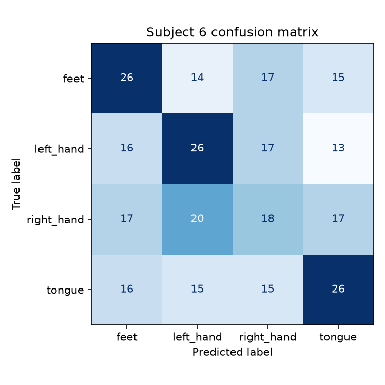
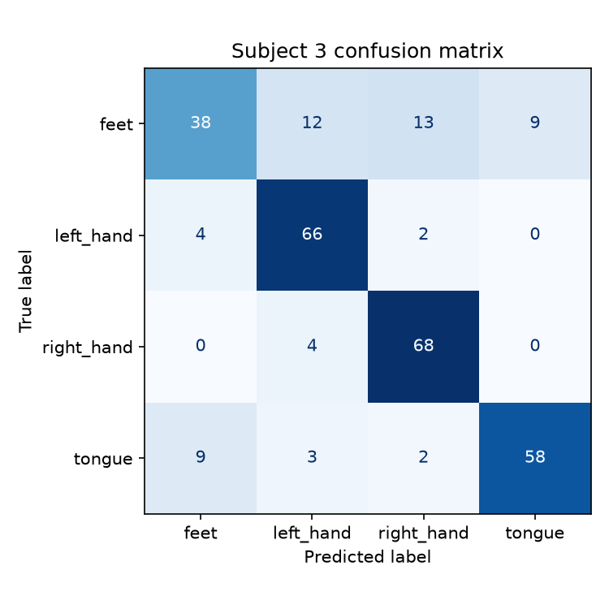

# Motor Imagery EEG Classification with Deep Learning

Classifying imagined limb movement (left hand, right hand, feet, tongue) from raw EEG using an
EEGNet-style CNN in PyTorch, compared against a classical CSP+LDA baseline.

Dataset: BCI Competition IV Dataset 2a (9 subjects, 22 EEG channels, 4-class motor imagery),
loaded via [MOABB](https://neurotechx.github.io/moabb/) (MOABB names it `BNCI2014_001`).

## Key results

- EEGNet: 59.2% mean validation accuracy across 9 subjects (chance = 25%)
- CSP+LDA baseline: 60.3% mean validation accuracy - essentially tied with EEGNet overall
- EEGNet wins on 6/9 subjects, but loses on the other 3 by a bigger margin, which is enough to
  tip the average slightly in the baseline's favor
- Best single result: 79.9% (EEGNet, subject 3)
- 4-class motor imagery, 22 EEG channels, 576 trials/subject total

## Methodology

- **Preprocessing**: raw EEG band-pass filtered to 4-38Hz (covers the mu/beta rhythms relevant
  to motor imagery), epoched to 0-4s relative to cue onset, all 22 channels used.
- **Split**: per subject, session T (288 trials) for training, session E (288 trials) for
  validation - the standard split for this dataset, and harder than a random shuffle since the
  two sessions were recorded on different days.
- **Model**: EEGNet-style CNN (3,444 trainable parameters), PyTorch. Adam optimizer, lr=1e-3,
  batch size 32, cross-entropy loss, up to 100 epochs with early stopping (patience=30) on
  validation loss.
- **Baseline**: CSP (Common Spatial Patterns, 8 components) + LDA - the standard classical
  method for motor imagery EEG, and what the original EEGNet paper itself compares against.
  Same train/val split as the deep learning model.

## Results

### Accuracy by subject

| Subject | EEGNet | CSP+LDA baseline |
|---|---|---|
| 1 | 74.3% | 69.1% |
| 2 | 36.5% | 48.6% |
| 3 | 79.9% | 73.6% |
| 4 | 57.6% | 54.9% |
| 5 | 41.3% | 35.8% |
| 6 | 33.3% | 46.5% |
| 7 | 55.6% | 62.8% |
| 8 | 76.7% | 74.7% |
| 9 | 77.8% | 76.7% |
| **Mean** | **59.2%** | **60.3%** |

Chance level is 25%.


EEGNet did not outperform CSP+LDA overall - mean accuracy was 59.2% for EEGNet vs. 60.3% for the
baseline. EEGNet wins on 6 of 9 subjects, by 1-6 points each. The baseline wins on the other 3
(subjects 2, 6, 7), by a bigger margin each time (7-13 points), which is enough to tip the
average. Those same 3 subjects are also EEGNet's weakest overall. My guess is that a compact CNN
with more free parameters overfits harder than CSP+LDA when the underlying signal is weak, while
it pulls ahead when the signal is stronger - but I haven't run anything (e.g. varying training
set size, checking train/val gaps per subject) to actually confirm that, so take it as a
hypothesis, not a finding. What the data does clearly show: on this dataset, the extra
flexibility of the neural network didn't translate into an overall accuracy advantage over a much
simpler classical method - it traded a small amount of average accuracy for a very different
per-subject profile. Performance varying this much by subject in general is consistent with
published results on this dataset.

### Confusion matrices: subject 3 vs subject 6

Comparing EEGNet's best and worst subjects shows the *type* of error is different, not just the
rate.

Subject 6 (33.3%): errors are spread evenly across every class pair. No two movements are
confused more than any other pair - close to random guessing.



Subject 3 (79.9%): the errors have structure. `left_hand` and `right_hand` recall are 91.7% and
94.4% - almost never confused with each other, consistent with the expected spatial organization
of motor cortex activity (left/right hand imagery activates opposite hemispheres, which tends to
be easier to separate from EEG). `feet` is this subject's weakest class at 52.8% recall, confused
with all three other classes about equally - foot motor representation is more medial and less
lateralized, which is a harder case to decode and matches what's reported in the literature.



### Training curve and an early-stopping mismatch

100-epoch run on subject 3, train vs val loss and accuracy:


Overfitting starts around epoch 30-40: training accuracy keeps climbing toward 90%+ while
validation accuracy flattens around 75-80%.

This also surfaced a mismatch between the early-stopping criterion and the metric I actually
care about: early stopping was tracking validation *loss*, but loss and accuracy don't
necessarily peak at the same epoch. A tighter loss-based stopping threshold cut training off at
epoch 61 and missed a later accuracy peak at epoch 85 (0.757 vs. 0.799 final accuracy). Since
this model trains in under a minute regardless, I made early stopping more lenient
(`patience=30`) rather than tune it to save a few seconds of runtime - the checkpoint logic
already saves whichever epoch had the best validation accuracy, so there's no benefit to cutting
training off aggressively.

## Why this project

This project explores deep-learning-based decoding of motor-imagery EEG using a compact CNN
architecture designed for EEG signals, benchmarked against a standard classical method. The goal
was hands-on experience with physiological time-series data, a PyTorch implementation of an
EEGNet-style architecture based on the published model, and an honest evaluation of when (and
when not) a deep learning approach actually outperforms a simpler one on a small biomedical
dataset.

## Project structure

```
motor-imagery-eeg-classification/
├── README.md
├── requirements.txt
├── data/                    # MOABB cache (gitignored)
├── checkpoints/             # saved model weights (gitignored)
├── results/                 # plots + csv from the analysis below
├── notebooks/
└── src/
    ├── model.py              # EEGNet
    ├── dataset.py             # loads BCI IV 2a via MOABB
    ├── train.py               # train one subject (EEGNet), CLI entry point
    ├── run_all_subjects.py    # train all 9 subjects, save accuracy comparison
    ├── baseline.py            # CSP+LDA classical baseline, one subject or --all
    ├── compare_baseline.py    # EEGNet vs baseline comparison table + chart
    ├── analyze_subject.py     # confusion matrix for a saved checkpoint
    └── utils.py               # seeding, device selection, early stopping
```

## Setup

```bash
cd ~/Documents/GitHub/motor-imagery-eeg-classification
python3 -m venv .venv
source .venv/bin/activate
pip install --upgrade pip
pip install -r requirements.txt
```

On Apple Silicon, `train.py` uses the `mps` backend automatically. Dataset downloads
automatically on first run (via MOABB, cached after that).

## Reproducing the results

```bash
python -m src.train --subject 3 --epochs 100 --plot
python -m src.run_all_subjects
python -m src.baseline --all
python -m src.compare_baseline
python -m src.analyze_subject --subject 6
```

## Possible extensions

- Leave-one-subject-out generalization: train on 8 subjects, test on the 9th, to see whether a
  model can generalize across people instead of being trained per-subject.
- Test the overfitting hypothesis directly (e.g. vary training set size, compare train/val gap
  per subject) instead of leaving it as a guess.
- Check subject 2 (other low performer) - same failure mode as subject 6, or different?
- Different frequency band (`fmin`/`fmax` in `dataset.py`) or epoch window (`tmin`/`tmax`).
- EEGNet hyperparameters (`F1`/`D`/`F2`/dropout in `model.py`).
- Early stopping on val accuracy instead of val loss.

## Troubleshooting

- Install issues: make sure the venv is activated (`which python` -> `.venv/bin/python`) before
  `pip install`.
- `ModuleNotFoundError: No module named 'src'`: run `python -m src.train ...` from the project
  root, not `python src/train.py`.
